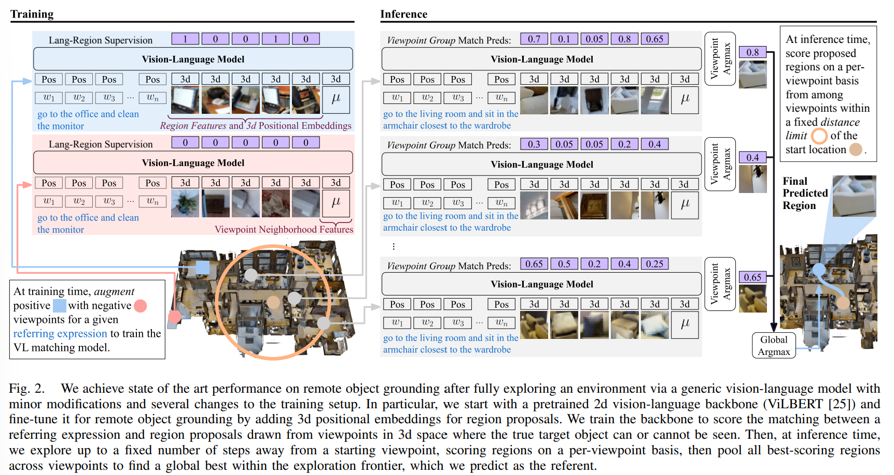

- **RREx-BoT Remote Referring Expressions with a Bag of Tricks**
 **[`arXiv 2023`]** *Gunnar A. Sigurdsson, Jesse Thomason, Gaurav S. Sukhatme, Robinson Piramuthu* [(arXiv)](http://arxiv.org/abs/2301.12614) [(pdf)](./../RREx-BoT%20Remote%20Referring%20Expressions%20with%20a%20Bag%20of%20Tricks.pdf) (Citation: 0)
    

    
    

  - **Remote Object Grounding**
    - RREx-BoT actively traverses the environment to **learn a map**, detecting object regions along the way, and *identifies which detected object in the 3D environment most closely matches the provided language referring expression.* 
  - **Bag of Tricks:**
    - Enable RREx-BoT to efficiently utilize a large-scale, pretrained **Language-and-vision alignment model** as a backbone to score hundreds of thousands of objects against an input referring expression. 

    

    
    

  - **Task Description:**
    - Agents navigate from a starting location and select the referent object based on region proposals at a goal location given a language referring expression. 
    - **Simulation Env**: discrete Matterport3D

  - **Challenges** in using off-the-shelf Vision-and-Language Models in remote grounding:
    - First, such VL models are trained only on 2d images
    - Second, these models output match scores between image proposals and target language in batches, but we cannot fit hundreds of thousands of object proposal regions in a single batch, making ranking language-image match scores between batches non-trivial. 
