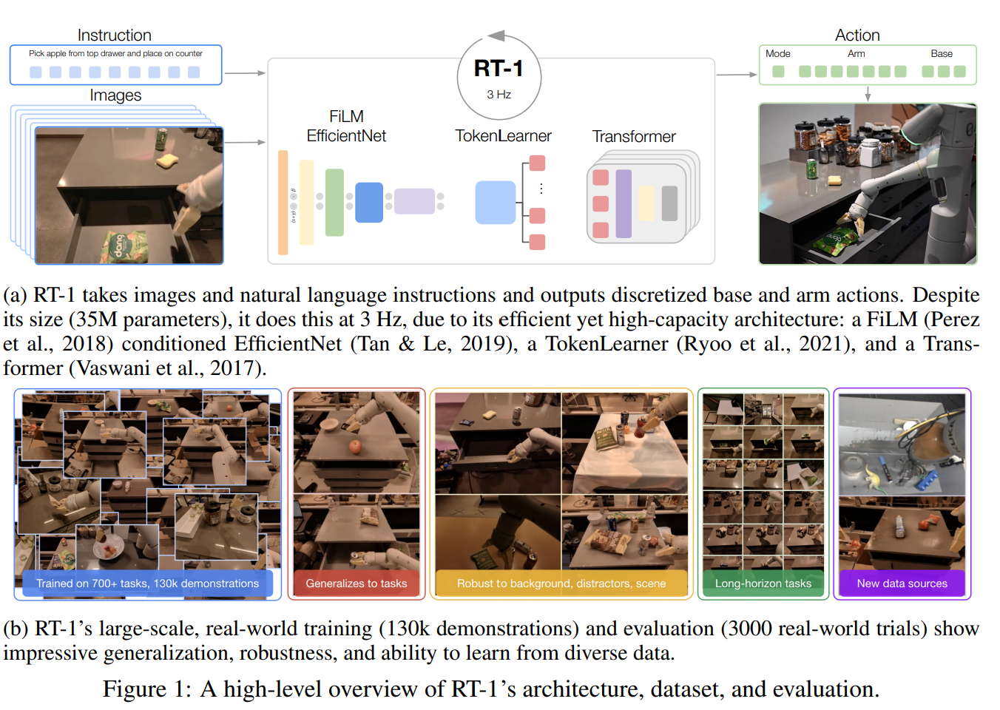
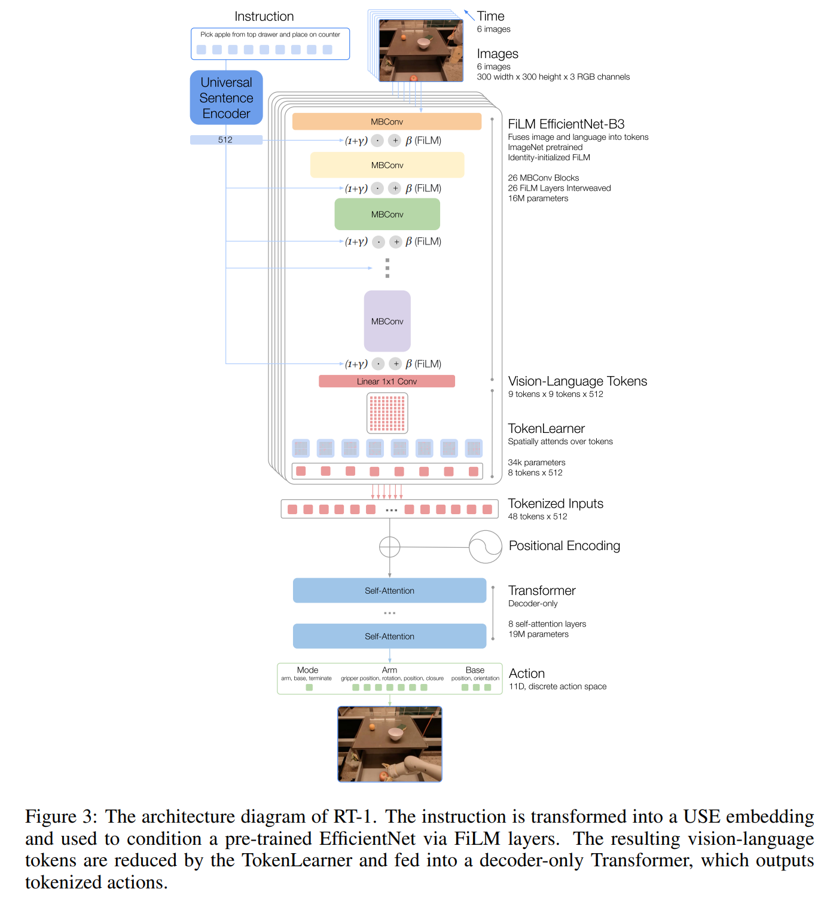

- **RT-1 Robotics Transformer for Real-World Control at Scale** **[`arXiv 2022`]** *Anthony Brohan, et al.* [(arXiv)](http://arxiv.org/abs/2212.06817) [(pdf)](./rt1%20-%20robotics%20transformer%20for%20real-world%20control%20at%20scale.pdf) [(Notes)](./ARI_Notes/rt1.md) (Citation: 107)
  - **Robotic Transformers**: 
    - General capability in robotic tasks.
    - Large Dataset + Large Model = General Agent
    

  - **Challenges:**
    - Assembling the right dataset (Embodiment-X)
      - RT-1 is trained on a dataset collected from real-world robots (13 robots in 17 months)
    - Designing the right model
      - RT-1 is a Transformer-achitecture model
  - **Training method:**
    - Imitation learning (supervised learning) 
  - **Model Architecture**:
    - Instruction and Image tokenization (FiLM EfficientNet): 
      - Instruction -> Universal Sentence Encoder
      - Image -> ImageNet Pretrained EfficientNet-B3
    - TokenLearner: 
      - To compress the number of tokens that RT-1 needs to attend over and speed up inference. 
      - Tokenlearner is an element-wise attention module that learns to map a large number of tokens into a smaller number of tokens. 
      - Only 8 final tokens are passed on to the Transformer layers.
    

    - Transformer:
      - 8 tokens per-image are than concatenated with other images in the history, forming 48 total tokens
      - Decoder-only sequence model with 8 self-attention alyers. 
    - Action tokenization:
      - Each action dimenison is discretized into 256 bins (uniformly distributed).
    - Loss: cross-entropy (since it is a classification problem).