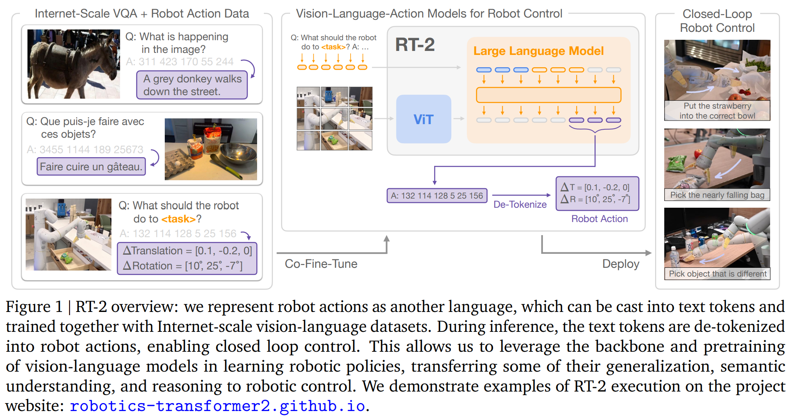
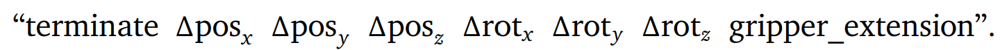
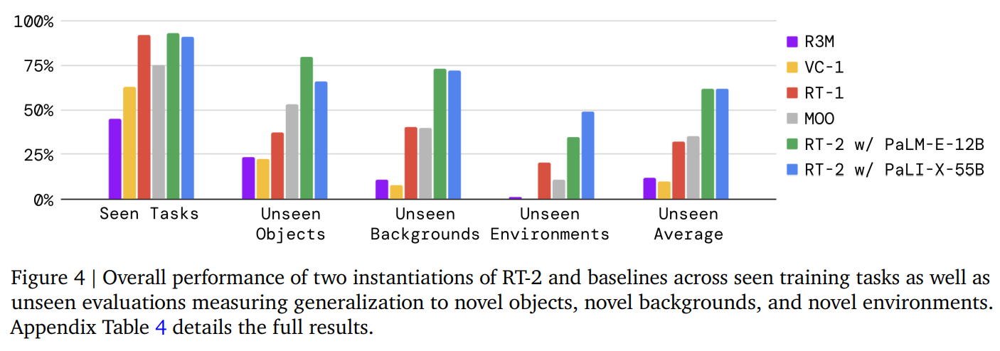

- **RT-2 Vision-Language-Action Models Transfer Web Knowledge to Robotic
  Control**
 **[`arXiv 2023`]** *Anthony Brohan, et al.* [(arXiv)](http://arxiv.org/abs/2307.15818) [(pdf)](./../rt2%20-%20vision-language-action%20models%20transfer%20web%20knowledge%20to%20robotic%20control.pdf)(Citation: 6)

  

    
  

  - **Objective**: Can large pretrained vision-language models be integrated directly into low-level robotic control to boost generalization and enable emergent semantic reasoning? -> Vision-Language-Action (VLA) model. 
  - **Approach**: Directly train vision-langauge models designed for open-vocabulary visual question answering and visual dialogue to output low-level robot actions.
    - Robot actions are tokenized into text tokens and create multimodal sentences. 
    - i.e., **Fine-tune a VLM using robot trajectory data.**
  - **VLA is built upon VLMs**: PaLI-X and PaLM-E
    - VLMs must be trained to output actions. **Representing actions as tokens in the model's output, treated in the same way as language tokens.**
    - Action Space: 6-DoF positional and rotational displacement of the robot end-effector; continuous dimensions are discretized into 256 bins uniformly. 
    - Convert action vector into a **single string**: 
    
    

    
    

    - **Input**: robot camera image and textual task description, using standard VQA format 
          ``Q: what action should the robot take to [task instruction]? A:`` 
    - **Output**: A string of numbers/least frequently used tokens representing a robot action.
          ``1 128 91 241 5 101 127``
  - **Robot-Action Fine-tuning**
    - Treat robot actions as tokens in the model's output, identical to text tokens. 
  - **Real-Time Inference**
    - The size of VLA is 55B parameters. It is running on a multi-TPU **cloud service** and querying this service over the network. 
    - The frequency of VLA is 1-3 Hz.
  - **Training Data**:
    - Web-scale Visual Question Answering
    - Unstructured interwoven image and text examples
    - Robot demonstration data (13 robots over 17 months in an office kitchen environment) 
  - **Add Chain-of-Thought**:
    - Augment the data to include an additional "Plan" step, which describes the purpose of the action that the robot is about to take in natural language first, which is then followed by the actual action tokens. 
      - For example: Instruction - I am hungry; Plan - Pick chocolate; Action: .....
      - This data augmentation scheme acts as a bridge between VQA datasets (visual reasoning) and manipulation datasets (generating actions).
  - **Limitations:**
    - Generalization capability is limited. 
      - The robot can only excel in seen tasks. 
      
    - Inference rate is slow and needs high computational resources.