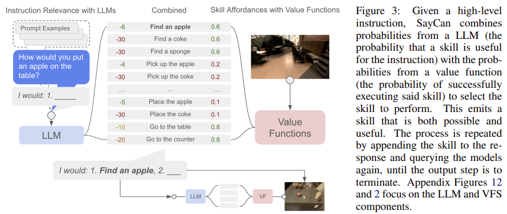

- **SayCan: Do As I Can Not As I Say Grounding Language in Robotic Affordances**
 **[`arXiv 2022`]** *Michael Ahn, Anthony Brohan, et al.* [(arXiv)](http://arxiv.org/abs/2204.01691) [(pdf)](./SayCan%20-%20Do%20As%20I%20Can%20Not%20As%20I%20Say.pdf) (Citation: 753)
  
  - **Challenges in LLM**:
    - LLM lacks real-world experience, making it difficult to leverage LLMs for decision-making within a given embodiment. 
    - For instance, asking a LLM to describe how to claen a spill might result in a reasonable narrative, but it may not be applicable to a real-world robot. 
    - **Grounding**
  
  - Saycan: provide **real-world grounding** that links the LLM and robotic tasks.
    - **Real-world Grounding**: LLMs have not interacted with their environment and observed the outcome of their responses, and thus are not grounded in the world.
    - Sometimes LLM will provide a strategy to perform a task but not work in the real world.
    
  - **Saycan links LLM and environment via**:
    - Low-level skills can be combined with LLMs so that the LLMs provide a plan and **value functions** assocaited with these skills provide the grounding.
    - The robot is equipped with a group of basic behaviors (i.e., low-level skills)
    - Each skill has a **affordance function** (similar to value function in RL), specifying how likely it is to succeed in completing the instruction from the current state. 
    - The **value function** of each skill that is additionally conditioned on the language command is generated via an RL method (i.e., Q-learning). 
  - **Prompt Engineering**: 
    - Break down high-level instruction into sequences of available low-level skills.
    - Add an **Explanation** section before querying possible actions. 
    
  - **SayCan**
    - $\pi \in \Pi$ is a skill, $\ell_\pi$ is language descirption
    - Value function: $p(c_\pi|s, \ell_\pi)$ is the probability of $c$-ompletion for the skill described by $\ell_\pi$ in state $s$. 
    - **Affordance Space**: $\left\{p\left(c_\pi \mid s, \ell_\pi\right)\right\}_{\pi \in \Pi}$ captures affordances across all skills. 
    
    - For each skill, the affordance function and the LLM probability are multiplied and ultimately the most probable skill is selected, i.e., $\pi=\arg \max _{\pi \in \Pi} p\left(c_\pi \mid s, \ell_\pi\right) p\left(\ell_\pi \mid i\right)$
    - Once the skill is selected, the coresponding policy is executed by the agent and the LLM query is amended to include $\ell_\pi$ and the process is run again until a termination token is chosen. 
  - **Dataflow**:
    - The LLM provides probabilities of a skill being useful for the high-level instruction $p_\pi^{\mathrm{LLM}}=p\left(\ell_\pi \mid i, \ell_{\pi_{n-1}}, \ldots, \ell_{\pi_0}\right)$
    - The affordances (value functions) provide probabilities of successfully executing each skill. $p_\pi^{\text {affordance }}=p\left(c_\pi \mid s_n, \ell_\pi\right)$
    - Combine these two probabilities together provides a probability that this skill furthers the execution of the high-level instruction. $p_\pi^{\text {combined }}=p_\pi^{\text {affordance }} p_\pi^{\text {LLM }}$
  
  

  - **Use RL to calculate Value Functions**
    - Vision observation is processed by 7 CNNs
    - Language is embedded by LLM then concatenated with the robot action and non-image parts of the state. 
    - Trained in Simulation with RetainGAN sim-2-Real transfer
    
  - **Use BC to generate language-conditioned policies (i.e. actions)**
    - The language is embedded by a Universal Sentence Encoder, then used to FiLM condition a Resnet-18 based architecture.
    - Trained with Demonstrations.
    