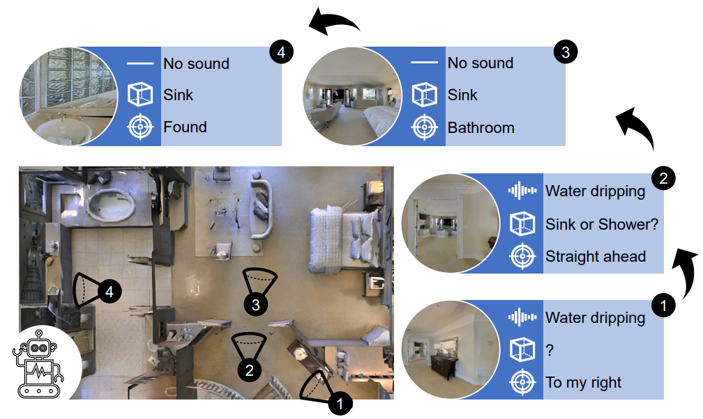
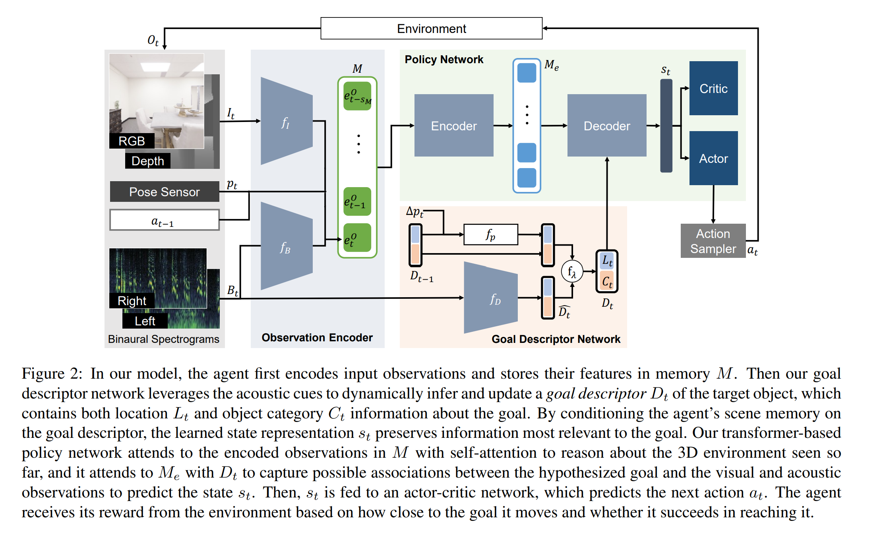

- **Semantic Audio-Visual Navigation**
 **[`CVPR 2021`]** *Changan Chen, Ziad Al-Halah, Kristen Grauman* [(arXiv)](http://arxiv.org/abs/2012.11583) [(pdf)](./../Semantic%20Audio-Visual%20Navigation.pdf) (Citation: 108)

  - **AudioGoal Task**
    - *Motivation*: Objects in the environment make sounds consistent with their semantic meaning
    - *Overview*: The agent must navigate to a sounding object.
      - The agent is incentivized to learn the association between how objects look and sound

        

        
        

    

  - **Data Acquisition**:
    - 3D Envs and Simulator:
      - *SoundSpaces* -> rendering arbitrary sounds at any pair of source and receiver locations on a grid spaced by 1 m.
      - *Matterport 3D* -> 3D environment
    - Semantic Sounds Collection:
      - 21 objects defined in the ObjectGoal navigation task for Matterport 3D env. 
      - Rendering object-specific sounds at the locations of the Matterport objects, we obtain semantically meaningful and contextual sounds.
  - **Approach**:
    - Introduce a *deep reinforcement learning* model to learn the association between how objects look and how they sound. 
    - Develop a *goal descriptor* to hypothesize that goal properties (i.e., location and object category) 

  - **Model:**
      

      
      

  
      - **Observation Encoder**: maps the egocentric visual and acoustic observations at each step to an embedding space (input to Transformer)
        - CNN encoders (ResNet-18, trained from scratch)
        - Inputs: 
          - visual -> RGB + depth images; 
          - audio -> bianural audio waveform
        - Outputs: 
          - Each modality has a CNN encoder, producing $e_t^I$ and $e_t^B$ for visual and audio, respectively
          - The observation includes $e_t^I$, $e_t^B$, the robot pose $p_t$, and last action $a_{t-1}$, i.e., $e_t^O=[e_t^I, e_t^B, p_t, a_{t-1}]$
        - The model stores the observations up to time $t$.  
      - **Goal Descriptor Network**: produces a goal descriptor (including location and category) based on the encoded observations
        - CNN model
        - Inputs $B_t$: audio signal
          - Audio carries rich cues about the target - not only its relative direction and distance from the agent, but also the type of object that may have produced the acoustic event. 
        - Outputs $\hat{D}_t$: estimated goal location $\hat{L}_t$ and predicted object label $\hat{C}_t$
          - To reduce the impact of noise from a single prediction, teh agent aggregates the current estimate with previous goal descriptor to get $D_t$
      - **Policy Network**: given the encoded observations and the predicted goal descriptor, extracts a descriptor-conditioned state representation and outputs the action distribution.  
        - Encoder: Inputs -> $M$, Outputs -> $M_e$
        - Decoder: Inputs -> $M_e$ and $D_t$, Outputs -> $s_t$
        - An Actor-Critic Network uses $s_t$ to predict action and critic networks (FNNs).
  - **Model Training:** 
    - Train goal descriptor:
      - Generate ground truth locations and categories from the simulator
      - Train with supervised learning
    - Train policy network:
      - two-stage training for distributed proximal policy optimization (DD-PPO)
        - Stage 1: set the memory size to be 1 to train the observation encoder. 
        - Stage 2: set the memory size to be 150 & freeze the observation encoder to train the rest of the model. 
        - Reward: 
          - +10 if the agent reaches the goal
          - +1 for reducing the geodesic distance to the goal and an equivalent penalty for increasing it. 
          - -0.01 per time step to encourage age efficiency. 