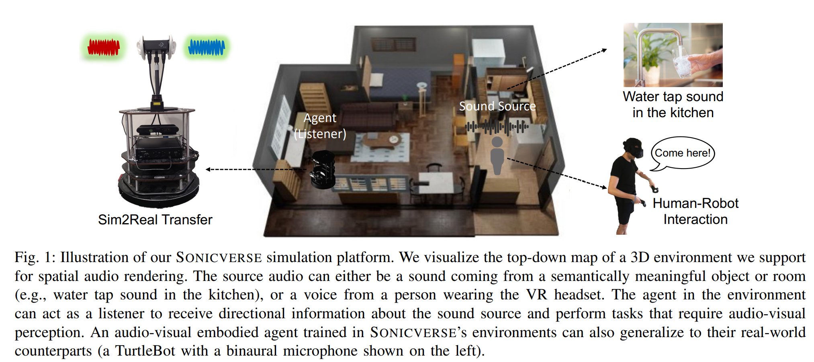
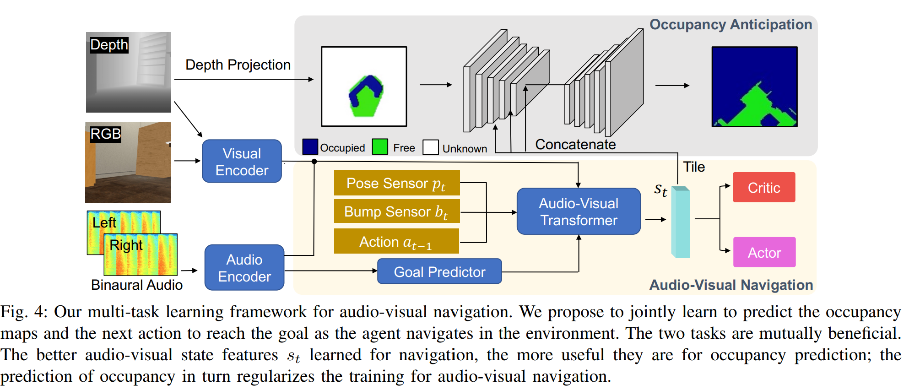

- **Sonicverse A Multisensory Simulation Platform for Embodied Household
  Agents that See and Hear**
 **[`ICRA 2023`]** *Ruohan Gao, Hao Li, Gokul Dharan, Zhuzhu Wang, Chengshu Li, Fei Xia, Silvio Savarese, Li Fei-Fei, Jiajun Wu* [(arXiv)](http://arxiv.org/abs/2306.00923) [(pdf)](./../Sonicverse%20-%20A%20Multisensory%20Simulation%20Platform%20for%20Embodied%20Household%20Agents%20that%20See%20and%20Hear.pdf) (Citation: 35)
  - Sonicerse 
    - A multisensory simulation platform with integrated **audio-visual** simulation for training household agents that can both see and hear.
    - Models realistic continuous audio rendering in 3D environments in real-time. 
    - With a new audio-visual VR interface that allows humans to interact with agents with audio. 
    - Semantic audio-visual navigation with a **multi-task learning framework**.
    - Implementation in the real-world environments

  - An overview

  

    
  

  
  - Robot hardware:
    - Camera: Asus XTION Pro RGBD
    - Onboard Computer: Intel NUC
  - Train Audio-Visual Embodied Navigation Agents in Sonicverse
    - Task: 
      - The agent is required to navigate to a specific semantically meaningful object in an unseen and unmapped environment by hearing the sound emitted by that object.
      - The agent has to reason about the semantic category of the souding object
    - Action and Observations:
      - Continuous action space over robot wheel velocities
      - Observations: an RGB image, a depth map, the binaural audio received at its two ears, a bump sensor input, and its current pose with respect to the starting location.    
    - Multi-task Learning Framework

    

    
    

      

      - Learn for semantic audio-visual navigation and occupancy map prediction
      - At each time step $t$, the agent receives visual observation consisting of an RGB and a depth map, and binaural audio at the agent's left and right ears. 
      - Extract visual and audio features from visual and audio encoders, respectively. 
      - Goal Predictor:
        - Inputs: audio feature and agent's current position 
        - Output: predict the sound source location + object category of the sound
      - Audio-Visual Transformer:
        - A memory module to encode the agent's observations
        - Uses a self-attention mechanism to reason about 3D environment seen so far. 
        - The decoder of the transformer takes the output of the goal predictor and the encoded observations in its memory, and predicts the state features $s_t$, which is then fed to an actor-critic network for predicting the next action $a_t$
      - Occupancy map prediction
        - Formulate it as a pixel-wise classification task
        - Represent the ego-centric occupancy as a top-down map $p\in[0,1]^{v \times v}$, which comprises a local area of $v \times v$ cells in front of the camera that represnets a region of 5m by 5m 
        - Use U-Net for occupancy map prediction
          - Inputs: depth camera