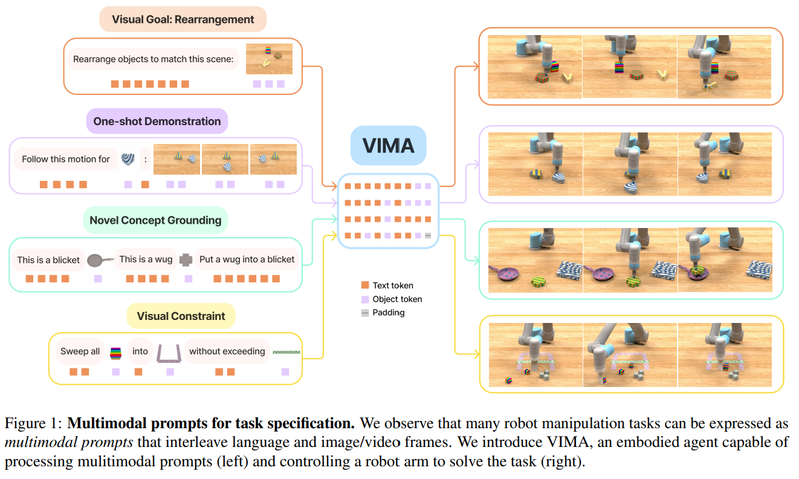
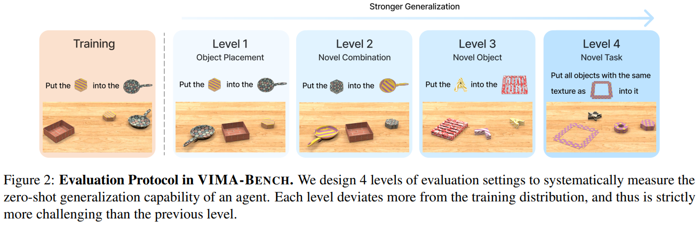
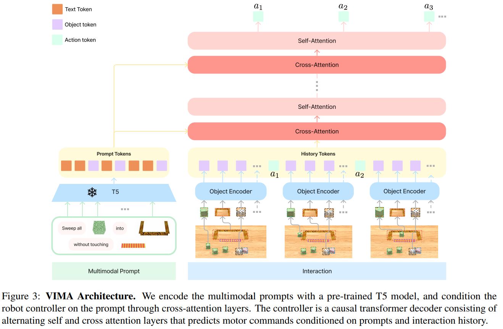

- **VIMA General Robot Manipulation with Multimodal Prompts**
 **[`ICML 2023`]** *Yunfan Jiang, Agrim Gupta, Zichen Zhang, Guanzhi Wang, Yongqiang Dou, Yanjun Chen, Li Fei-Fei, Anima Anandkumar, Yuke Zhu, Linxi Fan* [(arXiv)](http://arxiv.org/abs/2210.03094) [(Notes)](./ARI_Notes/vima.md) [(pdf)](./../VIMA%20-%20General%20Robot%20Manipulation%20with%20Multimodal%20Prompts.pdf) (Citation: 53)

    - VIMA: **Vi**suo**M**otor **A**ttention Agent
      - Learn robot manipulation from multi-modal prompts (language + text)
        
    - **Multimodal prompt**
      - **Simple object manipulation**: ``put <object> into <container>``
      - **Visual goal reaching**: manipulate objects to reach a goal configuration
      - **Novel concept grounding**: The prompt contains unfamiliar words
      - **One-shot video imitation**: watch a video demonstration and learn to reproduce the same motion trajectory for a particular object.
      - **Visual constraint satisfaction**: Manipulate the objects carefully to avoid violating the safety constraints.
      - **Visual reasoning**: tasks that require reasoning skills, such as apperance matching ``move all objects with same texture as <object> into <container>`` and visual memory ``put <object> in <container> and then retore to their original position``.
        
    - **VIMA Architecture**
      - 
      - **Multimodal prompt tokenization:**
        - Vision: Mask R-CNN to extract objects + ViT (trained from scratc)
        - Text: T5
      - **Action:** discretized into 256 bins
        - Autoregressivly predicts actions. 
    - **Training Method**: behavior cloning
    - **Training Data**: Robot trajectories (50K per task and 650K in total).