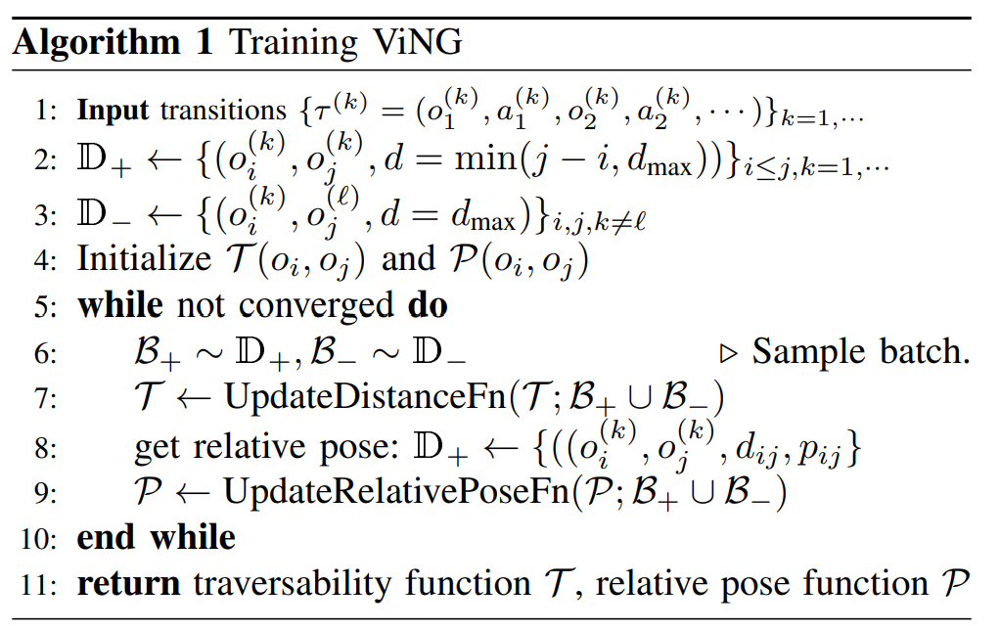
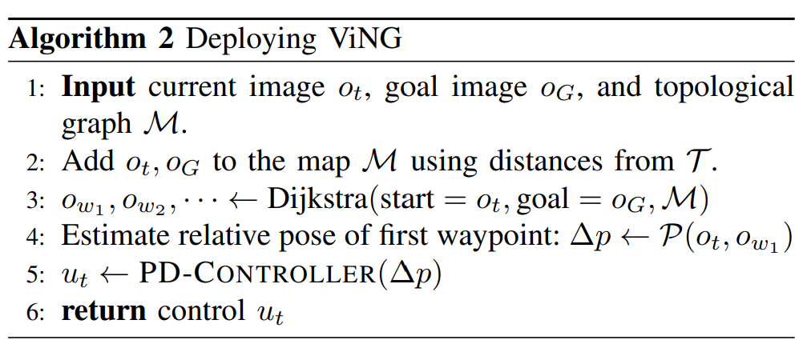

- **ViNG Learning Open-World Navigation with Visual Goals**
 **[`ICRA 2021`]** *Dhruv Shah, Benjamin Eysenbach, Gregory Kahn, Nicholas Rhinehart, Sergey Levine* [(arXiv)](http://arxiv.org/abs/2012.09812) [(pdf)](./../ViNG%20-%20Learning%20Open-World%20Navigation%20with%20Visual%20Goals.pdf) (Citation: 66)
  - **Objective**:
    - Propose a learning-based navigation system for reaching visually indicated goals and demonstrate this system on a real mobile robot platform.   
  - **Problem Statement**:
    - A robot is tasked with navigating to a goal location $G$ given an image observation $o_G$ taken at $G$. 
    - Outputs of the navigation model contain continuous linear and angular velocities.
  - **Training Steps**:
    - Aim to learn a traversability function $\mathcal{T}(o_i, o_j)$, indicating whether any controller can successfully navigate between observations $o_i$ and $o_j$. More specifically, learn to predict the estimated number of time steps $d_{ij}=j-i$ required by a controller to navigate from one observation to another. 
    

    
    

    - $\mathcal{T}(o_i, o_j)$ can be learned via (1) supervised learning and (2) temporal difference learning. 
    - In supervised learning, a **positive** dataset $\mathbb{D}_+$ contains observation pairs $(o_i, o_j)$ taken from teh same trajectory and regress to the number of timestpes $d_{ij}=j-i$ elapsed between observations. 
    - A **Negative** Dataset $\mathbb{D}_-$ is added. Reason: training the distance function using only observation pairs from the same trajectory performed poorly. 
    - Augment the dataset by adding $\mathbb{D}_-$, which contains sampling observations from different trajectories, labeled as $d_{max}$

  - **Deploying**
    - We build a topological graph $\mathcal{M}$ using the learned distance function together with a collection of previously-observed observations ${o_t}$. Each node in the graph corresponds to one of these observations. 
    - Add weighted edges between every node, using weights predicted by the distance function $\mathcal{T}$.
    - Use the weighted DJ algorithm to compute the shortest path to goal, and the immediate next node in the planned path is then handed over to the controller. 
  
    

    
    

  
  - **Implementation Details**:
    - $\mathcal{T}$ is a MobileNet Encoder followed by three densely connected layers to project 1024-dimensional latents to 50 class labels. 
    - $\mathcal{P}$ has similar structure, comprising of a MobileNet encoder followed by three densely connected layers projecting the 1024-dimensional latents to 3 outputs for waypoints: $\{\Delta_x, \Delta_y \}$