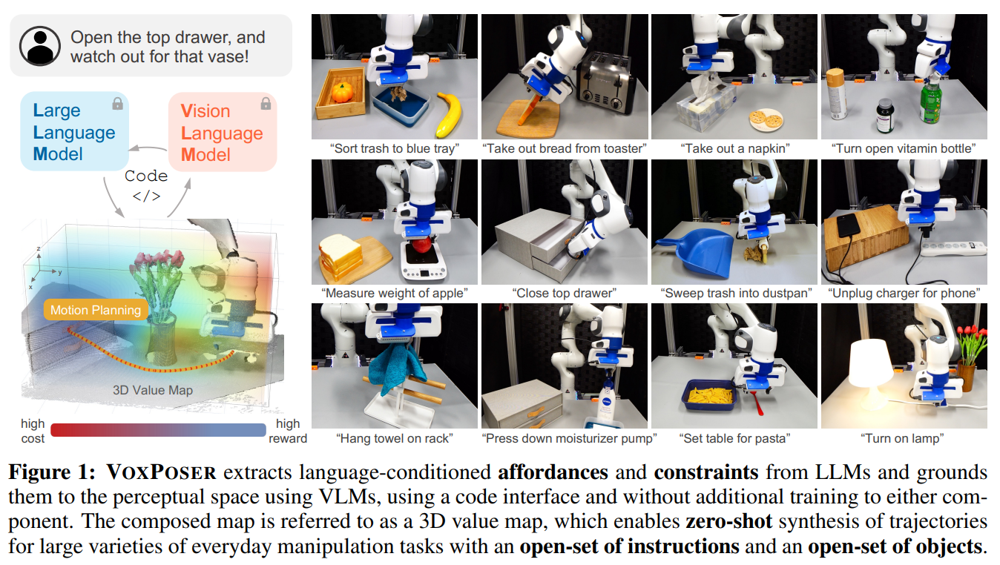

 - **VoxPoser Composable 3D Value Maps for Robotic Manipulation with
  Language Models**
 **[`arXiv 2023`]** *Wenlong Huang, Chen Wang, Ruohan Zhang, Yunzhu Li, Jiajun Wu, Li Fei-Fei* [(arXiv)](http://arxiv.org/abs/2307.05973) [(pdf)](./../VoxPoser%20Composable%203D%20Value%20Maps%20for%20Robotic%20Manipulation%20with%20LLMs.pdf) (Citation: 98)

    - **Challenge:** most LLMs still rely on pre-defined motion primitives to carry out the physical interactions with the environment, which remains a major bottleneck.
    - **Objective**: aim to **synthesize** *robot trajectories*, i.e., a dense sequence of 6-DoF end-effector waypoints, for a large variety of manipulation tasks given an open-set of *instructions* and an open-set of *objects*.
    

    
    
 