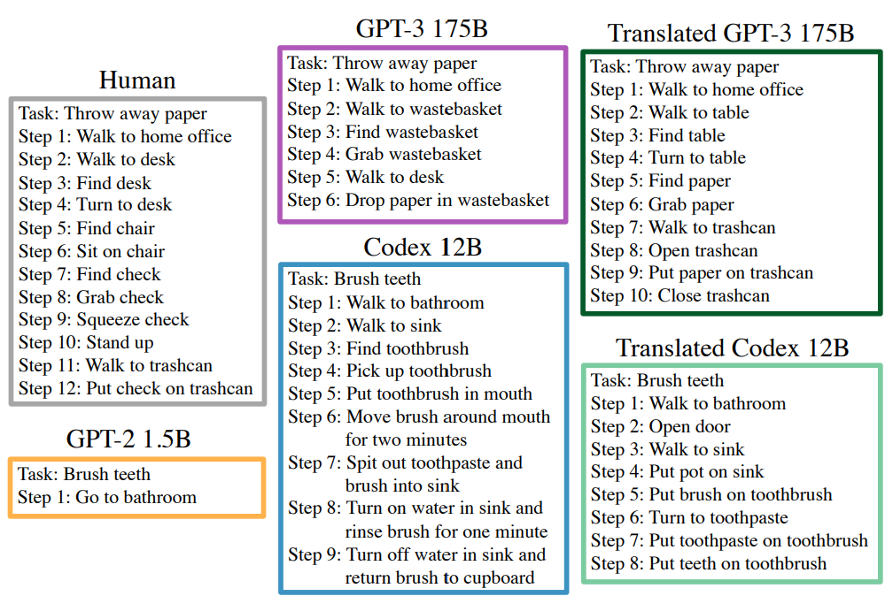
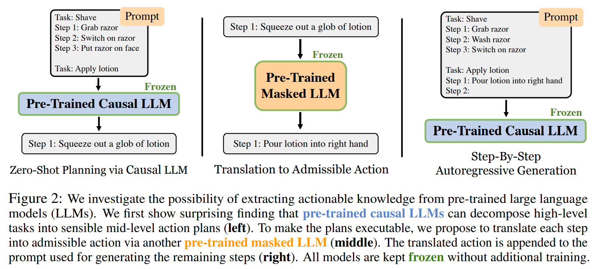

- **Language Models as Zero-Shot Planners Extracting Actionable Knowledge
  for Embodied Agents**
 **[`arXiv 2022`]** *Wenlong Huang, Pieter Abbeel, Deepak Pathak, Igor Mordatch* [(arXiv)](http://arxiv.org/abs/2201.07207) [(pdf)](./../Language%20Models%20as%20Zero-Shot%20Planners%20Extracting%20Actionable%20Knowledge.pdf) (Citation: 540)

     - **Central Question:** Can world knowledge learned by large language models (LLMs) be used to act in interactive environments?
     - **Objective:** In this paper, we investigate the possibility of grounding high-level tasks, expressed in natural language (e.g. “make breakfast”), to a chosen set of actionable steps (e.g. “open fridge”). 
     - **Finding:** if pre-trained LMs are large enough and prompted appropriately, they can effectively decompose high-level tasks into mid-level plans without any further training.
    
    

    
    

     - **Problem**: However, the plans produced naively by LLMs often cannot map precisely to admissible actions.
     - **Proposed** **method**: We propose a procedure that conditions on existing demonstrations and semantically translates the plans to admissible actions. 
       - We propose several tools to improve executability of the model’s outputs
         - **First**, we enumerate all admissible actions and map the model’s output phrases to the most semantically-similar admissible action.
         - **Second**, we use the model to autoregressively generate actions in a plan by conditioning past actions that have been made admissible via the technique above.
         - **Third**, we provide weak supervision to the model by prompting the model with a known task example similar to the query task.
     - **Experiment results**: Our evaluation in the recent VirtualHome environment shows that the resulting method substantially improves executability over the LLM baseline.
    
    

    
    
 