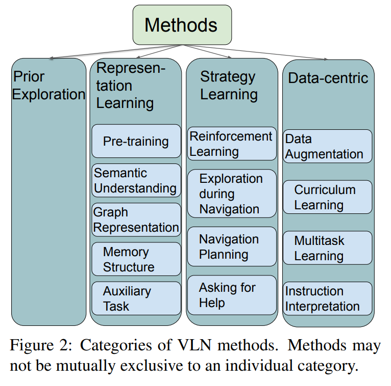

## Large Language Model-based Agents Review

- **The Rise and Potential of Large Language Model Based Agents A Survey**
 **[`arXiv 2023`]** *Zhiheng Xi, Wenxiang Chen* [(arXiv)](http://arxiv.org/abs/2309.07864) [(pdf)](./The%20Rise%20and%20Potential%20of%20Large%20Language%20Model%20Based%20Agents%20-%20A%20Survey.pdf) (Citation: 22)
  - **Large Language Model-based Agents**:
    - Employ LLMs as the primary component of brain or controller of these agents and expand their perceptual and action space through strategies such as multimodal perception and tool utilization. 
  - **Why is LLM suitable as the primary component of an Agent's brain?**
    - Autonomy
      - LLMs demonstrate autonomy throught their ability to generate human-like text, engage in conversations, and perform tassk without detailed step-by-step instructions.
      - Dynamically adjust their outputs based on environmental inputs
      - Coming up with novel ideas, stories, or solutions that haven't been explicitly programmed into them. 
      - Auto-GPT: 
        - Input: A task & a set of available tools 
        - Output: plans to achieve the ultimate goal
    - Reactivity: the ability to respond rapidly to immediate changes and stimuli in its environment
      - Input: Visual and Auditory information
      - One major challenge is that LLM-based agents, when performing non-textual actions, **require an intermediate step of generating thoughts or formulating tool usage in textual form** before eventually translating them into concrete actions.
    - Pro-activeness: LLMs don't merely react to their environments; process the capacity to display goal-oriented actions by proactively taking the initiative. 
      - LLMs can reason, make plans, and take proactive measures in their actions to achieve specific goals or adapt to environmental changes. 
    - Social Ability: the capacity to interact with other agents
      - Agent-human interaction 
  - **Framework of LLM-based agent**
    
    - Brain
      - Store knowledge and memories
      - Information processing and decision-making
      - Present the process of reasoning and planning
      - Cope with unseen tasks
    - Perception
      - Broaden the agent's perception space from text-only to multimodal sphere that includes textual, auditory, and visual modalities.
    - Action
      - Emobodied action ability and tool-handling skills

  - **Brain**
    - The ability to engage in natural language interaction is important to ensure effective communication.
    - After receiving the information processed by the perception module, the brain first turns to storage, retrieving in **knowledge** and recalling from **memory**.
      - **Knowledge** is from training data. Large-scale dataset can encode a wide range of knowledge into their parameters and respond correctly to various types of queries.
        - Linguistic Knowledge
        - Commonsense knowledge 
        - Professional domain knowledge
      - **Memory** stores sequences of agent's past observations, thoughts, and actions.
        - When faced with complex problems, memory help the agent to revisit and apply antecedent strategies effectively. 
        - LLM-based agents process prior interactions in natural language format, appending historical records to each subsequent input. 
        - Challenges: 
          - Sheer length of history records. The length of memory may surpass the constraints of Transformer architecture. 
          - Difficulty in extracting relevant memories: as agents gather a vast array of historical observations and action sequences, they grapple with an escalating memory burden, making establishing connections between related topics increasingly challenging.
    - Use the retrieved knowledge for generating plans, reasoning, and making informed decisions. 
      - Reasoning: Chain-of-Thought (CoT) is used to guide LLMs to generate rationales before outputting the answer. 
      - Planning: 
        - Decompose problems comprehensively and formulate a complete plan at once and then execute it sequentially.
        - CoT-series: plan and address sub-tasks one at a time
        - Hierarchical planning (tree-like plan) 
    - Memorize the agent's past observations, thoughts, and actions and update the knowledge for future use. 
    - Adapt to unfamiliar scenarios with its inherent generalization and transfer ability. 

 

- **LLM Powered Autonomous Agents** ([Lil'Log](https://lilianweng.github.io/posts/2023-06-23-agent/))

    

    
    

  - **Planning**
    - *Subgoal and decomposition*: the agent breaks down large tasks into smaller, manageable subgoals, enabling efficient handling of complex tasks.
      - **Chain of Thought (CoT)**: the llm model is instructed to "think step by step" to utilize more test-time computation to decompose hard tasks into smaller and simpler steps. 
      - **Tree of Thoughts**: extends CoT by exploring multiple reasoning possibilities at each step. Problem -> multiple steps -> multiple thoughts per step -> a tree structure -> search for solution with BFS (breadth-first search) or DFS (depth first search)
    - *Reflection and refinemen*: the agent can do self-criticism and self-reflection over past actions, learn from mistakes and refine them for future steps, thereby improving the quality of final results.
      - **ReAct**: integrates reasoning and acting within LLM by extending the action space to be a combination of task-specific discrete actions andn the language space. 
      - **Reflexion**: is a framework to equips agents with dynamic memory and self-reflection capabilities to improve reasoning skills. Reflexion has a standard RL setup, in which the reward model provides a simple binary reward and the action space follows the setup in **ReAct** where the task-specific action space is augmented with language to enable complex reasoning steps. After each action $a_t$, the agent computes a heuristic $h_t$ and optionally may *decide to reset* the environment to start a new trial depending on the self-reflection results. 
      

      
      

      - **Chain of Hindsight**: encourages the model to improve on its own outputs by explicitly presenting it with a sequence of past outputs, each annotated with feedback. Human feedback data is a collection of $D_h=\{(x_i, y_i, r_i, z_i)\}_{i=1}^n$, where $x$ is the prompt, each $y_i$ is a model completion, $r_i$ is the human rating of $y_i$, and $z_i$ is the corresponding human-provided hindsight feedback. Assume the feedback tuples are ranked by reward, $r_n>r_{n-1}>...>r_1$, the process is supervised fine-tuning where the data is a sequence in the form of $\tau_h$. The model is finetuned to only predict $y_n$. 
  - **Memory**
    - *Short-term memory*: in-context learning. 
    - *Long-term memory*: retain and recall information over extended periods, often by leveraging an external vector store and fast retrieval. 
  - **Tool use**
    - The agent leanrs to call external APIs (tools) for extra information, including current information , code execution capability, access to proprietary information sources and more.
    - **HuggingGPT** is a framework to use ChatGPT as the task planner to select models available in HuggingFace platform according to the model descriptions and summarize the response based on the execution results.
    

    
    

 

- **Large Language Models for Robotics A Survey**
 **[`arXiv 2023`]** *Fanlong Zeng, Wensheng Gan, Yongheng Wang, Ning Liu, Philip S. Yu* [(arXiv)](http://arxiv.org/abs/2311.07226) [(pdf)](./Large%20Language%20Models%20for%20Robotics%20-%20A%20Survey.pdf) (Citation: 9)
 
 

 

- **Vision-and-Language Navigation A Survey of Tasks Methods and Future
  Directions**
 **[`arXiv 2022`]** *Jing Gu, Eliana Stefani, Qi Wu, Jesse Thomason, Xin Eric Wang* [(arXiv)](http://arxiv.org/abs/2203.12667) [(pdf)](./Vision-and-Language%20Navigation%20-%20A%20Survey%20of%20Tasks,%20Methods,%20and%20Future%20Directions.pdf) (Citation: 70)

  

  
  

  - **Challenges in Vision-Language-Navigation Models**:
    - VLN faces a complex environmetn and requires effective understanding and alignment of information from different modalities. 
    - VLN agents require a reasoning startegy for the navigation process.  
    - The generalization of a model trained in seen enviornmnets to unseen environments is also essential. 
  - **Evaluation**:
    - Goal-oriented metrics:
      - Success rate, 
      - Goal progress (remaining distance to the target goal),
      - Path length (total length of the navigation path),
      - Shortest-Path Distance (mean distance between the agent's final location and the goal). 
  - **Solution to VLN**:

    

    
    

    - **Representation learning** methods help understand information from different modalities
      - Pretained LLM: 
        - VLA Model: ViLBERT
        - VLN Models: VLN-BERT pretrains navigation models to measure the compatibility between paths and instructions, formting VLN as a path selection problem.
      - Semantic Understanding
      - Graph Representation
        - Building graph to incorporate structured information from instruction and environment observation provides explicit semnatic relation to guide the navigation.  
    - **Action strategy learning** aims to make reasonable decisions based on gathered information
      - Reinforcement Learning: VLN is a sequential decision-making problem. But the problem of RL for VLN is that VLN agents only receive the success signal at the end of the episode (sparse reward).
      - Exploration during Navigation
      - Navigation Planning
      - Asking for help: ask humans for help when uncertain about the next action. 
    - **Data-centric learning methods** effectively utilize the existing data and address data challenges such as data scarcity
      - Data Augmentation: Trajectory-instruction augmentation
      - Environment augmentation: randomly masking the same visual feature across different view points
      - Curriculum Learning: gradually increases the task's difficulty during the training process
      - Multitask Learning: Different VLN tasks can benefit from each other by cross-task knowledge transfer. 
      - Instruction Interpretation: break down long instruction into short and more concise instructions.
    - **Prior exploration** helps the model familiarize itself with the test environment. 
      - Previous exploration methods allow the agent to observe and adapt to unseen environments, bring the gap between seen and unseen environments. 

