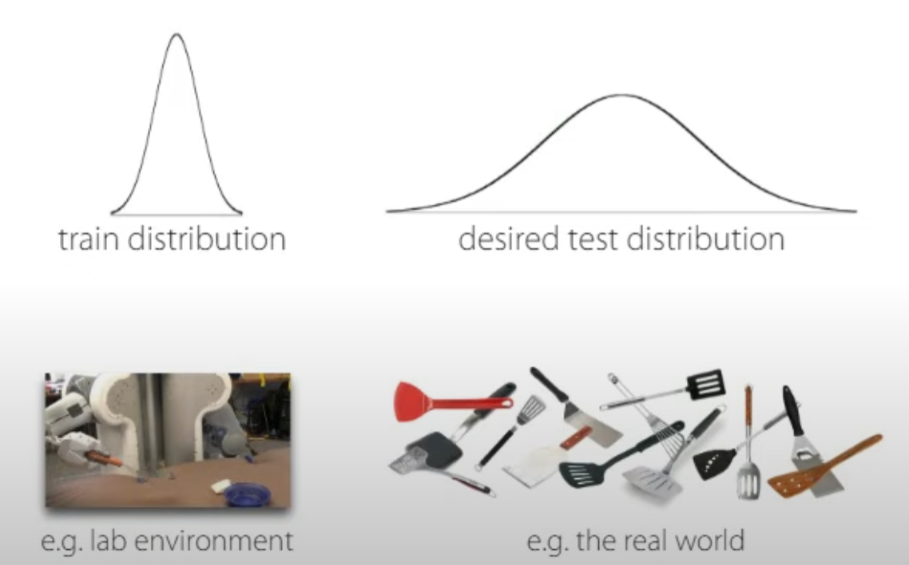

### Lectures in Robotics

#### Standford Webinar - The Frontier of Deep Learning for Robotics
- **Video link**: [Here](https://www.youtube.com/watch?v=yGgO4PAnj6o&list=WL&index=39)
- **Highlights**:
  - How can robots generalize to the real world? 
    

    
    

    - **Solution 1**: train on a *larger*, *broader* dataset
    - **Solution 2**: generalize beyond the training distribution
      - Can we train at test too?
  - Can we train on data across many tasks?
    - **Case 1**: imitation from human demo
    - **Case 2**: imitation from language instructions
    - 
