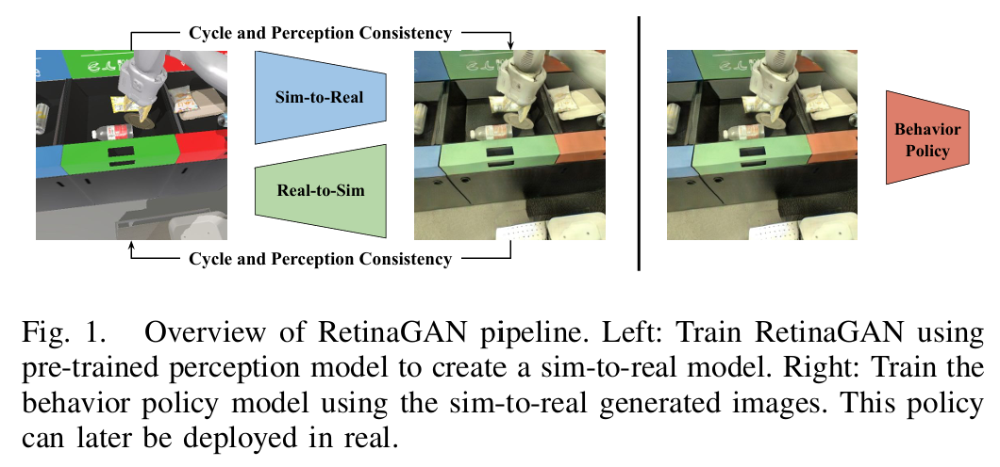

## **RetinaGAN An Object-aware Approach to Sim-to-Real Transfer**
 
**[`ICRA 2021`]** *Daniel Ho, Kanishka Rao, Zhuo Xu, Eric Jang, Mohi Khansari, Yunfei Bai* [(arXiv)](http://arxiv.org/abs/2011.03148) [(pdf)](./../RetinaGAN%20-%20An%20Object-aware%20Approach%20to%20Sim-to-Real%20Transfer.pdf) (Citation: 52)

* **Abstract**:
  * RL and IL in vision-based robotic manipulation face limitations in sim-to-real gap. 
    * This gap appears when train an RL agent in simulation, and the visual observations between the simulation and real-world is different. 
    * To approach this problem, a RetinaGAN, a generative adversarial network (GAN) approach, is trained to adapt simulated images to realistic ones with **object-detection consistency**.
    * RetinaGAN is trained in an unsupervised manner without task loss dependencies, and preserves general object structure and texture in adapted images.  

* **Introduction**:
  * Why simulation? 
    * Simulation provides a safe, controlled platform for policy training and development with known ground truth labels. 
    * Simulated data can be cheaply scaled. 
  * Why Sim-to-Real gap? 
    * However, directly executing such a policy in the real world typically performs poorly, even if the simulation configuration is carefully controlled, due to visual and physical differences between the domains known as reality gap. 
  
* **RetinaGAN**:
  * Leverage an object detector trained on both simulated and real domains to make predictions on original and translated images, and we enforce the invariant of the predictions with respect to the GAN translation. 
    
    

    
    

  * To train the RetinaGAN, the loss is made by 
    * CycleGAN loss + Perception Consistency loss
  * Perception Consistency Loss:
    * This is the detection difference between simulated images and real-world images. 
    
    

    
    

* **Task Policy Models**:
  * Policy Model: Q2-Opt (distributed RL method)
* **Experiment Designs**

    

    
    

  * Train RetinaGAN on 135K real grasping episodes and Q2-Opt on 211K real episodes. 
  * Also run a low data experiment using 10K real episodes for training both RetinaGAN and Q2-Opt. 
