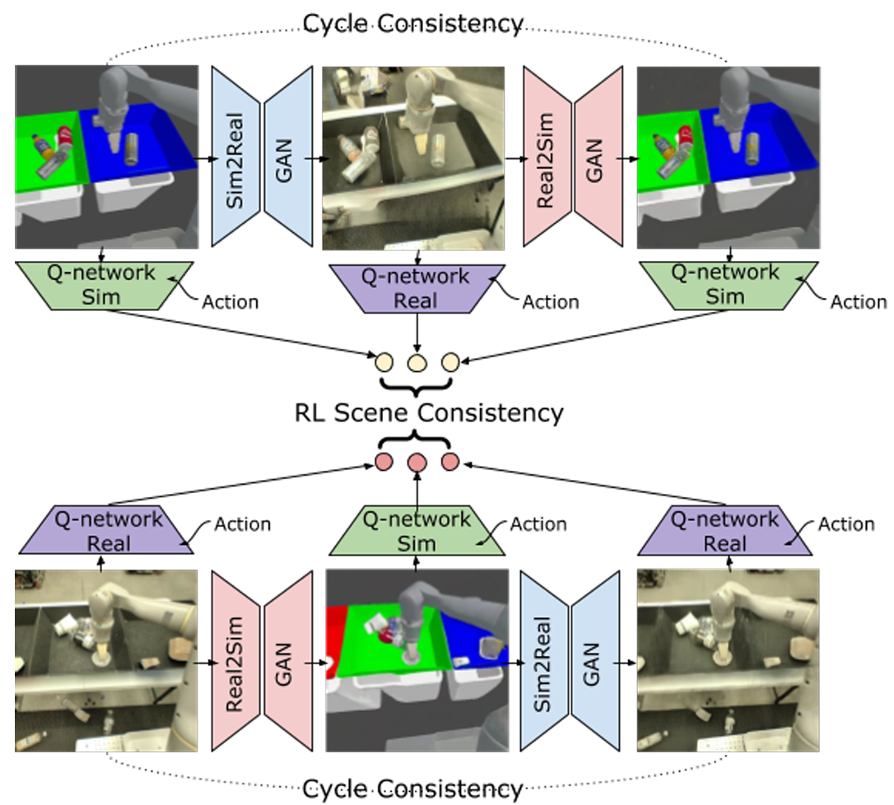

### **RL-CycleGAN Reinforcement Learning Aware Simulation-To-Real**
 **[`CVPR 2020`]** *Kanishka Rao, Chris Harris, Alex Irpan, Sergey Levine, Julian Ibarz, Mohi Khansari* [(arXiv)](http://arxiv.org/abs/2006.09001) [(pdf)](./../RL-CycleGAN%20Reinforcement%20Learning%20Aware%20Simulation-To-Real.pdf) [(Notes)](Citation: 202)

 * The **key** for a useful sim-to-real model is to adapt simulted images to realistic images while also preserving the original semantics relevant to RL tasks.  

 * Model Structure

    

    
    

* The RL task is a deep Q-network $Q(s, a)$
  * For vision-based task, $s$ is the input image and $a$ is a candidate action. 
  * $Q_{sim}(s, a)$ and $Q_{real}(s, a)$ represent Q-functions trained on simulated and real images, respectively. 
  * There will be **6** Q values.
    * 3 yellow nodes + 3 red nodes in the image.
    * 3 yellow nodes should be similar to each other and 3 red nodes should be similar to each other.   -> $\mathcal{L}_{RL-scene}$
  * Also, Q-networks are trained to select good actions to maximize the accumulated rewards. -> $\mathcal{L}_{RL}$
  * Total loss -> $\mathcal{L}_{cyc} + \mathcal{L}_{RL-scene} + \mathcal{L}_{RL}$